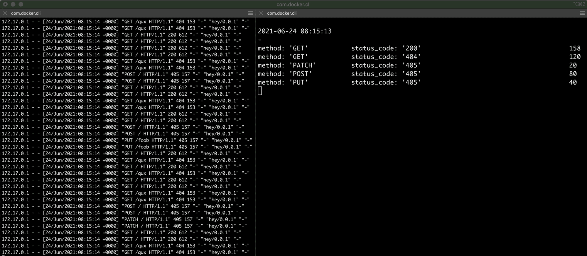

# pq - Parse and Query log files as time series

**Project is actively being developed!**


## Why

I often find myself staring at Nginx or Envoy access logs `tail`ed to my screen
in real time.  My only wish at that moment is to be able to aggregate the lines
somehow and analyze the output at a slower pace. Ideally, with a familiar and 
concise query language. Something like that would do:

```bash
tail -f /var/log/nginx/access.log | \
    pq 'sum(sum_over_time(content_len{status_code="2.."}[1s])) by (method) / 1024'
```


##  How

The idea is pretty straightforward - most of the log files around are essentially time series.

If we could **parse** an input stream into a series of structured records, we
would be able to **query** the derived stream with PromQL-like expressions.

**pq** reads the input stream line by line, applies some decoding and mapping,
and produces such structured _records_.

Simply put, the records are key-value dictionaries. There are three types of entries:

- _metrics_ (or _tags_) - entries with lower cardinality
- _values_ (or _fields_) - entries with higher cardinality
- _timestamp_ - the one that makes the input stream a time series.

**pq** can also query such a stream of timestamped records with a concise query language.
The query results can be printed with one of the supported formatters (human-readable,
JSON, Prometheus API) or displayed on the screen in an interactive way.


## Demo

The stage consists of a web server and some number of concurrent clients generating the traffic.

```bash
# Launch a test web server.
docker run -p 55055:80 --rm --name test_server nginx 2>/dev/null

# In another terminal, start pouring some well-known but diverse traffic.
# Notice, `-q` means Query Rate and `-c` means multiplier.
hey -n 1000000 -q 80 -c 2 -m GET http://localhost:55055/ &
hey -n 1000000 -q 60 -c 2 -m GET http://localhost:55055/qux &
hey -n 1000000 -q 40 -c 2 -m POST http://localhost:55055/ &
hey -n 1000000 -q 20 -c 2 -m PUT http://localhost:55055/foob &
hey -n 1000000 -q 10 -c 2 -m PATCH http://localhost:55055/ &
```

Access log in the first terminal looks impossible to analyze in real-time, right? Interactive `pq` mode to the rescue!

### Secondly HTTP request rate with by (method, status_code) breakdowns

```bash
docker logs -n 1000 -f test_server 2>/dev/null | \
    pq '/[^\[]+\[([^]]+).+?\s+"([^\s]+)[^"]*?"\s+(\d+)\s+(\d+).*/ 
        | map { .0:ts, .1 as method, .2:str as status_code, .3 as content_len } 
        | select count_over_time(__line__[1s])' \
    -i
```




## Secondly traffic (in KB/s) aggregated by method

Slightly more advanced query - use aggregation by HTTP method only:

```bash
docker logs -n 1000 -f test_server 2>/dev/null | \
    pq '/[^\[]+\[([^]]+).+?\s+"([^\s]+)[^"]*?"\s+(\d+)\s+(\d+).*/ 
        | map { .0:ts, .1 as method, .2:str as status_code, .3 as content_len } 
        | sum(sum_over_time(content_len[1s])) by (method) / 1024' \
    -i
```


For more use cases, see [tests/scenarios folder](tests/scenarios).


## Usage

`pq` command-line tool accepts _a program_ as its only required argument. A program must
start from a _decoder_ that can be followed by a _mapper_, and then by a _query_. Also,
an optional _formatter_ can be applied at the end:

```bash
pq '<decoder>'
pq '<decoder> | <formatter>'
pq '<decoder> | map <mapper>'
pq '<decoder> | select <query>'
pq '<decoder> | map <mapper> | select <query>'
pq '<decoder> | map <mapper> | select <query> | <formatter>'
```

### Decoders

Currently supported input decoders:

- regex `/.../` - uses a regex with match groups to split lines on fields
- JSON `json` - expects a JSONL input stream

Coming soon decoders:

- CSV
- logfmt (_aka_ scanf)
- Prometheus
- InfluxDB
- Nginx
- Apache
- Envoy
- etc...


### Mappers

The result of decoding is a stream of _entries_. Depending on the decoder and the input
stream, an entry can be a _tuple_ or a _dictionary_. The following syntax is used to map
an entry to a full-fledged record that can be then used at the query stage.

...for a tuple entry:

```bash
<decoder> | map { .0, .1, .3  }  // pick up first, second, and forth elements of a tuple
                                 // produces the following object: { f0: <val>, f1: <val>, f3: <val> }

<decoder> | map { .0 as foo, .1 as bar } // produces object { foo: <val>, bar: <val> }
```

...for a dictionary entry:

```bash
<decoder> | map { .foo, .bar  }  // filters out all other fields
                                 // produces the following object: { foo: <val>, bar: <val> }

<decoder> | map { .foo as qux }  // produces object { qux: <foo's val> }
```

Record fields are strongly typed. Entry fields may or may not be typed. `:<type>` can be used
to explicitly set the type of the resulting field:

```bash
<decoder> | map { .foo:str as qux, .bar:num as abc, .baz:ts }
```

Only the following types are supported at the moment: `str`, `num`, `ts [<optional format like "%Y-%m-%d">]`.
If the format of a timestamp field is not specified, `pq` will try to guess it based on the input samples.


### Query language

The query language is heavily influenced by PromQL. Hopefully existing PromQL
skills should be totally transferable.

Normally, a query starts from a metric selector:

- `body_bytes` - matches all records with the `body_bytes` metric.
- `body_bytes{method="GET"}` - takes only GET requests.
- `body_bytes{method!="GET", status_code~="5.."}` - takes failed non-GET requests.

A query is executed with a given frequency (by default _1 sec_) and a selector 
returns the latest closest sample from the stream. To get multiple samples, a time 
duration can be added:

- `body_bytes[1s]` - returns secondly buckets of samples
- `body_bytes{status_code!="200"}[1h30m15s5ms]` - returns all non-200 records for the past `~1h30m`.

An operator or a function can be applied to a selector.

Supported operators:

- arithmetic `+ - / * ^ %`: `body_bytes{method="GET"} + body_bytes{method="POST"}` or `body_bytes{} / 1024`
- comparison: `== != <= < >= >`: `body_bytes{} > 1000`
- aggregation `avg() bottomk() count() group() man() min() sum() topk()`: `min(body_bytes)`
- coming soon - more aggregations `quantile() stderr() stdvar()`
- coming soon - logical `and unless or`

Supported functions:

- `avg_over_time(selector[duration])`
- `count_over_time(selector[duration])`
- `last_over_time(selector[duration])`
- `min_over_time(selector[duration])`
- `max_over_time(selector[duration])`
- `sum_over_time(selector[duration])`
- coming soon - other well-known functions...

And most of the expressions can be combined. Ex:

```SQL
sum(sum_over_time(content_len[1s])) by (method) / 1024
```

### Formatters

Currently supported output formatters:

- human-readable (implicit, used by default)
- JSON `to_json`
- Prometheus API-like `to_promapi`
- interactive via `-i` flag.

Coming soon formatters:

- PromQL

Additionally, the following flags and named arguments are supported:

```bash
FLAGS:
    -i, --interactive
    -v, --verbose

OPTIONS:
    -I, --interval <interval>  # same meaning as in Prometheus
    -b, --lookback <lookback>  # same meaning as in Prometheus
    -s, --since <since>
    -u, --until <until>
```

## Usage by example

The input is seen by `pq` as a stream of records. Typical example:

```bash
$ cat > access.log <<EOF
172.17.0.1 - - [07/Jul/2021:20:28:01 +0000] "POST / HTTP/1.1" 405 157 "-" "hey/0.0.1" "-"
172.17.0.1 - - [07/Jul/2021:20:28:02 +0000] "GET / HTTP/1.1" 200 612 "-" "hey/0.0.1" "-"
172.17.0.1 - - [07/Jul/2021:20:28:03 +0000] "GET /foo HTTP/1.1" 404 153 "-" "hey/0.0.1" "-"
EOF
```

 _Hello world_ `pq` program:

```bash
$ cat access.log | ./target/release/pq '/.*/'

# Produces
172.17.0.1 - - [07/Jul/2021:20:28:01 +0000] "POST / HTTP/1.1" 405 157 "-" "hey/0.0.1" "-"
172.17.0.1 - - [07/Jul/2021:20:28:02 +0000] "GET / HTTP/1.1" 200 612 "-" "hey/0.0.1" "-"
172.17.0.1 - - [07/Jul/2021:20:28:03 +0000] "GET /foo HTTP/1.1" 404 153 "-" "hey/0.0.1" "-"
```

To start splitting records on fields, you can use...

Under construction...


## Development

Contribution is always welcome!

```bash
# Build it with
make

# Test it with
make test-all
make test-e2e

# Run a certain e2e test
E2E_CASE=vector_matching_one_to_one_010 make test-e2e
```

## Glossary

- Time Series - a stream of timestamped values, _aka_ samples sharing the same metric name and, optionally, the same set of labels (i.e. a unique combination of key-value pairs).
- Metric name - a human-readable name of a measurement. E.g. `http_requests_total`, `content_length`, etc).
- Metric type - counter, gauge, histogram, and summary.
- Label - a dimension of the measurement. E.g. `method`, `url`, etc.
- Sample - _aka_ data point - a (value, timestamp) tuple. Value is always float64 and timestamp is always with millisecond precision.
- Instant vector - a type of expression evaluation - a set of time series (vector) containing a single sample for each time series, all sharing the same timestamp.
- Range vector - a type of expression evaluation - a set of time series containing a range of data points over time for each time series.
- Scalar and string - two other expression evaluation results.
- Vector selector - expression of a form `<metric_name>[{label1=value1[, label2=value2, ...]}][[time_duration]]`.
